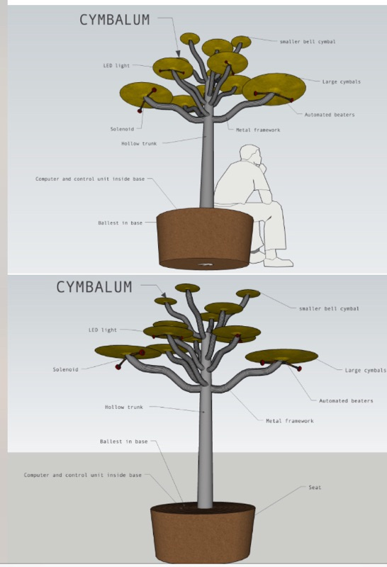
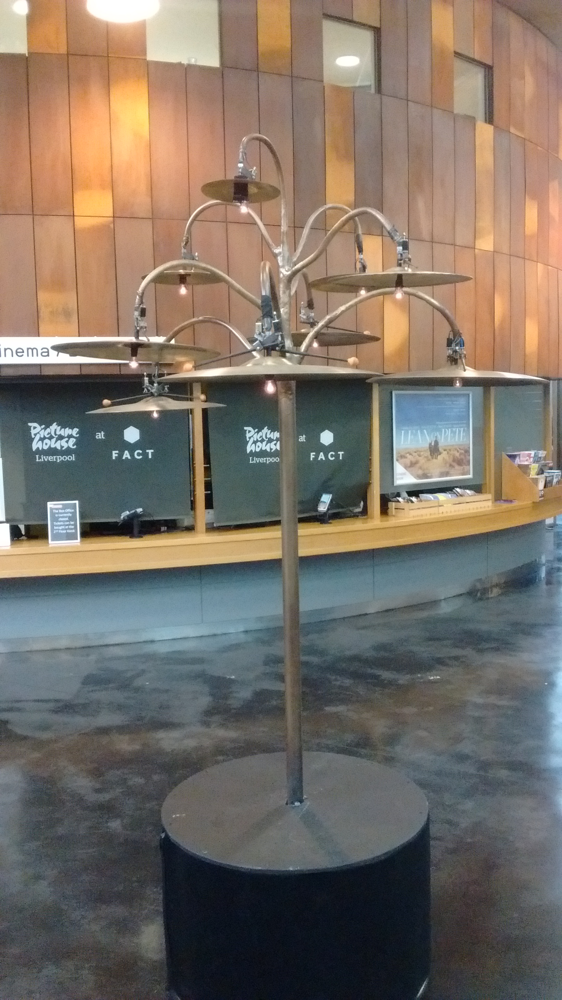
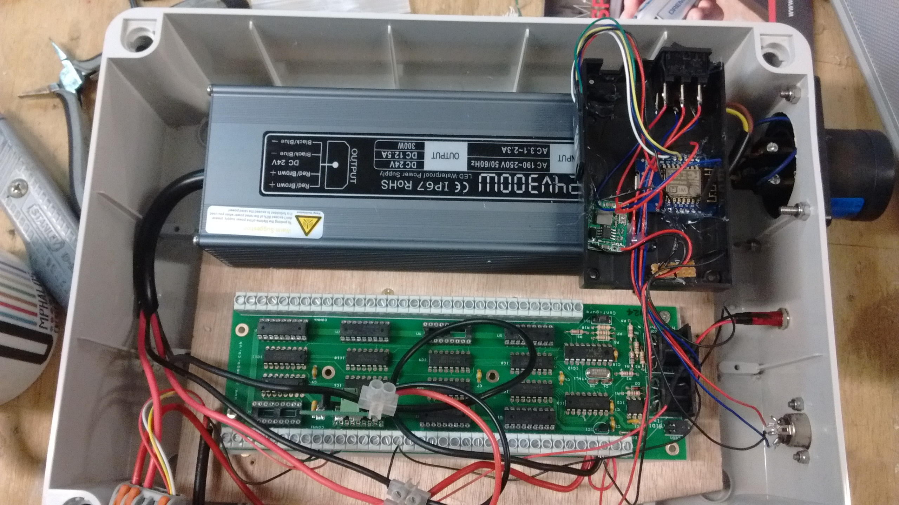
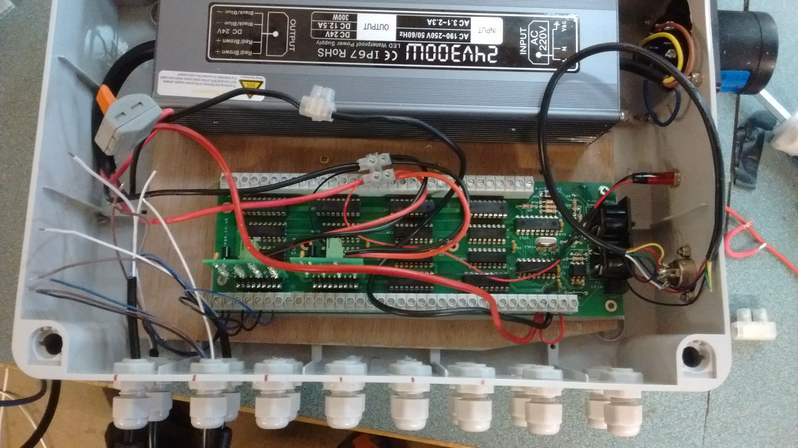

# Cymbal Tree

Midi controlled, solenoid driven cymbal tree.

## Hardware

## Wiring Diagram

## Interface

Wemos D1 mini

[SD card module](https://github.com/espressif/arduino-esp32/tree/master/libraries/SD)

[midi output](https://www.arduino.cc/en/Tutorial/Midi)

## Software

OTA update

SD card reader
